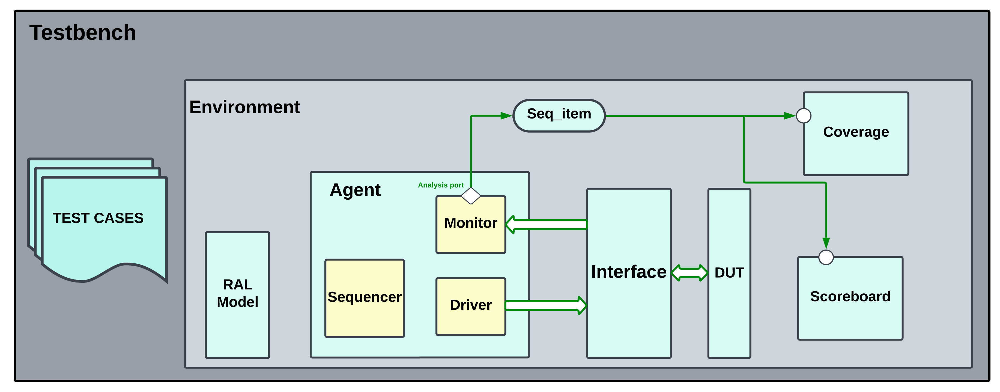

# RISC-V 5-Stage Pipelined Verification Project

This phase focuses on verifying a 5-stage pipelined RISC-V processor using the Universal Verification Methodology (UVM). The verification covers various instruction types and addresses the occurrence of hazards, corner cases, and memory interactions. It uses UVM RAL (Register Abstraction Layer) for memory verification and employs assertions to verify internal control signals.

# Supported Instruction Types

| Instruction Type | Abbreviations |
|---|---|
| I-type | lw, slli, srli, srai, jalr, addi, slti, xori, ori, andi |
| R-type | add, sub, sll, slt, xor, srl, sra, or, and |
| B-type | beq, blt, bge, bne |
| S-type | sw |
| U-type | auipc, lui |
| J-type | jal |
